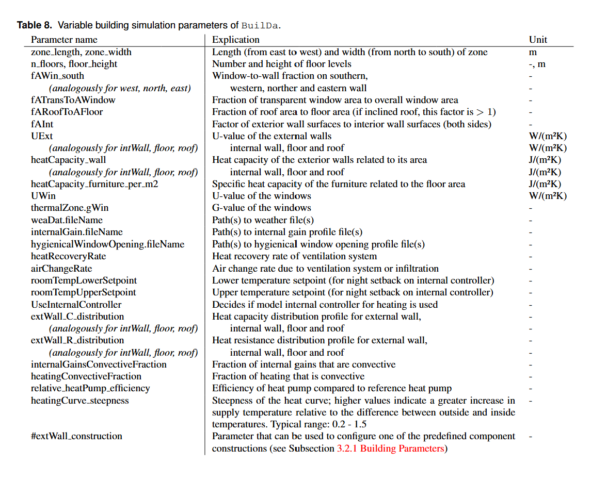

# Setup


## Load Repository
To setup BuilDa clone the repo and go into the directory


```bash
git clone https://github.com/fabianraisch/BuilDa.git
cd BuilDa
```


## Create conda environment
Setup conda environment using the conda_env.yml  

```bash 
conda env create -f conda_env.yml
```
Activate the created conda environment
```bash
conda activate BuilDa
```


# Getting started
In the base directory execute  

```bash
python3 ./main.py
```

Optionally set parameters for FMU-File, configuration file and output directory to use (order of arguments doesn't matter)  

```bash
python3 ./main.py --fmu <my_model>.fmu --config <my_config>.json --output <my_output_folder> --schedule <my_schedule>.json
```

use

```bash
python3 ./main.py --help
```
for more info.


# Configuration of simulations
The configuration of the simulations as well as the buildings to be simulated is done in a json-file located in resources/configurations.  

Open [tutorial_use_cases.md](tutorial_use_cases.md) to see a tutorial on the model configuration in BuilDa.

See [General configuration parameters](#general-configuration-parameters) to see how to configure the simulation in BuilDa.


# Variation of parameters
In the variations section of the config file, the parameters of the model itself can be set. There can be set more than one value per parameter by listing the values in brackets. With at least one parameter with multiple values, a simulation series is defined, indicating that there will be executed more than one simulation. There are generally two different methods to handle multiple parameters with more than one value set:

**zip variation:** The values are used for the parameters consecutivelly for each simulation of the simulation series. The longest value set determines the number of simulations. To create the final parameter value sets the last values of shorter value sets from other parameters are used. This method can be used if e.g. 10 different simulations should be executed, without combining each value with each other.

Example: 

```
zone_length: [5, 10], zone_width: [4, 8], floor_height: [2.5]
```

Resulting parameter sets: 

	zone_length: 5, zone_width:4, floor_height: 2.5
	zone_length: 10, zone_height:8, floor_height: 2.5

**cartesion product variation:** simulations with every possible configuration using the configured value sets

Example: 

```
zone_length: [5, 10], zone_width=[4, 8], floor_height: [2.5]
```

Resulting parameter sets:
```
zone_length: 5, zone_width:4, floor_height: 2.5
zone_length: 5, zone_width:8, floor_height: 2.5
zone_length: 10, zone_width:4, floor_height: 2.5
zone_length: 10, zone_width:8, floor_height: 2.5
```

## Model parameters (section variations)

The model parameters to be varied are located in the variations section of the configuration file. These include mainly building properties like
- zone dimensions like zone length, width, and floor height
- component properties like heat capacity and heat resistance (expressed by U-value) for external walls, internal walls, roof, and floor
- component resistance and capacity distribution, allowing for the configuration of inhomogeneous components
- quality of windows including solar heat gain coefficient and their U-value

but as well parameters allowing for the loading of external data about user behavior and weather, and parameters affecting the heating system and controller.
A list of the parameters is shown in the following table.





## General configuration parameters
Besides the model related parameters (mainly building specific parameters), additionally general simulation parameters can be set. 

Parameters related to the simulation time or step sizes can be set as an integer (time in seconds) or a string representing containing number and unit (e.g. 1y: 1 year, 1min: 1 minute, etc., note: only time units with constant length are supported, thus month isn't supported)


| Parameter Name                     | Description                                                                                          | Example Parameters                      |
|------------------------------------|------------------------------------------------------------------------------------------------------|-----------------------------------------|
| variation_type                     | Type of variation of the simulation parameters (see [README.md](README.md)). Available options are 'zip' and 'cartesian_product'. For additional information see [README.md](README.md)         | cartesian_product, zip                       |
| converter_functions                | Functions that handle various conversions and calculations for the model (see [README.md](README.md)). Only advanced users should modify this.                          | Link_resolver, Miscellaneous_handler, Model_compatibility_layer, Zone_dimensions_calculator, RC_Distribution_Configurator, Component_properties_calculator, Nominal_heating_power_calculator, Nominal_cooling_power_calculator |
| controller_name                    | List of controllers available to control e.g. heating, cooling syste, window opening or other parts of the model.                                             | TwoPointController_heating, PIController_cooling              |
| controller_step_size               | Time step size for the controller in seconds.                                                      | 90, "1.5min"                                      |
| start_time                         | The start time for the simulation, can be set as an integer or a string.                           | 0, "0s"                                       |
| stop_time                          | The end time for the simulation, in seconds.                                                       | 31536000, "1y"                                |
| writer_step_size                   | Time step size for writing output data, in seconds.                                               | 900, "15min"                                     |
| time_columns_included              | List of time columns to be exported. Options include various time representations.                  | "second", "second_of_day", "day_of_year", "year", "day_of_week", "hour_of_year"     |
| columns_included                   | List of FMU parameters to be exported, representing various thermal and weather conditions.        | "thermalZone.TAir", "totalHeatingPower.y", "weaBus.TDryBul", "weaBus.HDirNor", "weaBus.HDifHor", "weaBus.HGloHor" |


## Weather and human behavior profiles
### Weather
Outside weather, window-opening behavior and human activity profiles are specified in the config.

Using 
```
 python3 ./resources/mos_generator.py [startyear] [endyear] [latitude (optional)] [longitude (optional)] [output filename (optional)]
```
weather data for specific locations from Jan. 1st (startyear) to Dec. 31st (endyear) can be freshly pulled from [PVGIS](https://joint-research-centre.ec.europa.eu/photovoltaic-geographical-information-system-pvgis_en) over different time periods which then is stored in `./resources/weatherData/[output filename]`. Start and end should lie in between 2005 and 2020. 

### Behaviour profiles

Multiple representative human behavior profiles are supplied in `./resources/internalGainProfiles` and `./resources/hygienicalWindowOpeningProfiles`.

Alternatively, window opening profiles and activity profiles with possible user changes over time can be generated using the script `./resources/profile_generator.py`.

List of parameters used for the profiles:

| Name              | Description               | Unit      |
|-------------------|---------------------------|-----------|
| `n_persons`       | the amount of persons the household consists of |    |
| `sleeptime`         | `[from, to]` wallclock time, the (or all) user sleeps | h |
| `rmr = 1.62*bodymass`| resting metabolic rate. The amount of heat a resting human radiates | W |
| `met_profile`     | activity profile over one day in multitudes of rmr with shape `(hour of day, [holiday, workday, saturday, sunday])` |         |
| `non-human-profile` |  activity profile of household appliances, shape same as `met_profile` | W  |
| `open_after_min`  | The amount of minutes 1 person rests in the room after which they'd want fresh air | min |
| `consciousness`   | weight parameter to alter the air quality at which the window is opened. 1 meaning the windows are opened after 1 person spends `open_after_min` resting, 0 meaning no windows are opened and 2 meaning the window is already openend after `open_after_min`/2  |     |

The profiles can be used by changing the config entries `internalGain.fileName` and `hygienicalWindowOpening.fileName` to the generated files before simulation.

## Scheduling parameter updates

During a simulation, parameters can be changed to emulate new occupants moving in or a retrofit being executed on the house. To use a schedule, pass one to the builda program by using the 
```bash
python3 main.py --schedule <path_to_schedule>.json
```
The schedule is specified through a special config that contains timestamps for the different scheduled changes and what is changed:

```
{
    "100d": {"UExt": 0.25, "UInt": 0.3, "Occupancy": "Empty"},
    "150d": {"Occupancy": "Couple_over_65", "roomTempLowerSetpoint": 22, "roomTempUpperSetpoint": 24, "UExt": 0.1, "UInt": 0.1},
    "200d": {"UWin": 1.0, "Heater": "new"},
    "250d": {"UExt": 0.11}
}
```
Timestamps can be provided as String numbers followed by a unit (s, min, d, w, y) or as an integer in seconds.

As the default behavior, the maximum heating power is **not** recalculated for every update, it has to be triggered manually by specifying "Heater": "new".
A full list of occupancy profiles (heat dissipation and window opening by occupants, see above for more detail) can be found below:

| short name | description | windowOpening available |
|------------|-------------| ----------------------- |
|"Empty"     | no occupants live in the house. Thus, there is no thermal dissipation | yes |
|"base_example" | exemplary profile for one working person | yes |
|"ASHRAE_BASE_EXAMPLE" | - | no |
|"Couple_both_at_work" | two mature persons with regular working hours | yes |
|"Single_with_work"    | a single mature person with regular working hours | yes |
|"Family_both_at_work_2_children" | two mature persons working regularly with two children | yes |
|"Couple_over_65"      | two eldery retired persons | yes |
|"Student_Flatsharing" | three young students sharing an appartment | yes |

To schedule custom occupancy profiles, `internalGains.fileName` and `hygienicalWindowOpening.fileName` can be updated in the schedule (instead of using the "Occupancy" keyword)

# Simulation output
There are plenty of simulation output parameters (configurable as output parameters in the config JSON), with the most important being:

| Variable Name                          | Description                                                                                         | Unit        |
|----------------------------------------|-----------------------------------------------------------------------------------------------------|-------------|
| `thermalZone.TAir`                    | Zone air temperature                                                                                | K           |
| `totalHeatingPower.y`                  | Heating power emitted by the heating system                                                         | W           |
| `totalHeatingPowerWithGain.y`          | Heating power emitted by the heating system and internal heat gains by persons or electric devices (if configured) | W           |
| `weaBus.TDryBul`                       | Outside temperature                                                                                 | K           |
| `weaBus.HDirNor`                       | Normal direct solar radiation                                                                        | W/m²        |
| `weaDat.weaBus.HGloHor`                | Global horizontal solar radiation                                                                    | W/m²        |
| `weaBus.HDifHor`                       | Diffuse horizontal solar radiation                                                                   | W/m²        |
| `ventilationHeatLosses.Q_flow`        | Ventilation heat losses (including natural and mechanical ventilation)                               | W           |
| `Q_heating_MWh.y`                      | Total heat emitted during the simulation period by the heating system                               | MWh         |


# About the use of custom FMUs
## Introduction FMU
The provided FMUs are binary, platform-dependent files that execute the building model they contain. FMU parameters can generally be configured by writing them into the config JSON. To simplify model configuration, a converter layer has been implemented, allowing users to configure only basic parameters while more complex calculations are handled within converter functions. Consequently, only a limited number of parameters in the config JSON are intended to be passed directly to the FMU, while the majority are utilized to compute the actual FMU parameters through the converter functions.

## Use of custom FMUs
Advanced users wishing to implement a custom FMU generated from a specific model must ensure that the parameterization in the config JSON and the associated converter functions produce outputs (variable names and values) compatible with the FMU. If this compatibility is not established, proper model configuration cannot be guaranteed. It is essential that every parameter the user intends to modify in the FMU is accurately named, whether in the model itself, the config JSON, or the converter functions.

***Example:***  In our version of BuilDa, there are the configuration parameters `zone_length` and `zone_width` that are needed by the converter function `Zone_dimensions_calculator` to calculate `thermalZone.VAir` (zone volume), `thermalZone.AFloor` (zone floor area), and a lot more parameters used to configure the model. If in a new, custom FMU the length and width of the zone must be set in the model itself, the converter function `Zone_dimensions_calculator` is not needed anymore. Instead, the zone length and zone width could be set with their respective parameter names and values directly in the config JSON.

## Ensure compatibility with external controllers
External controller classes utilize model input and output parameter names configured as strings. To ensure compatibility, the model must provide the desired inputs and outputs with matching names. Alternatively, the controllers may need to be parameterized accordingly.

# About the use of custom controllers
## Controller input and controller output parameters
External controller classes must utilize proper model input and output parameter names configured as strings. While the developer of a controller class is relativelly free in choosing the controller input parameter as model variable, the controller output parameter must correspond to a model parameter where the value can be set during the simulation. For now, the following input parameters are implemented in the model (equals usable controler output parameters):

| Name                       | Range | Explanation                                                                |
|----------------------------|-------|----------------------------------------------------------------------------|
| `ctrSignalHeating`           | 0-1   | Control signal for heating                                                 |
| `ctrSignalCooling`           | 0-1   | Control signal for cooling                                                 |
| `ctrSignalWindowOpening`     | 0-1   | Control signal for window opening (influences air exchange and thus, zone temperature change) |

## Structure of a controller class
A newly created, custom controller class should always inherit from the `Controller` base class or one of their child classes.
Standard class parameters are:


| Variable Name      | Explanation                                         |
|--------------------|-----------------------------------------------------|
| `parameters_y`     | Controller input parameters                          |
| `parameters_u`     | Controller output parameters                         |
| `parameters_etc`   | Other model variables used to calculate controller output |
| `w`                | Setpoint                                            |
| `u_max`            | Upper limit for controller output                   |
| `u_min`            | Lower limit for controller output                   |

There must be always a `control` function in the controller class that accepts two parameters: a name-value dictionary representing the current FMU state (which includes at least the necessary FMU variables configured in the parameters of the controller class) and the current simulation time (essential for PI-Controllers to compute the integral).

The purpose of the control function is to modify the controller output variable within the FMU state dictionary and return the updated dictionary. The update of the FMU parameter values is then handled by BuilDa.

# Annotations
- If model internal heating controller is activated in the config JSON, the external heating controllers are not loaded. Criterion for external heating controller: output is `ctrSignalHeating` (heating controller interface of fmu)
- If more than one controller generates output for the same model interface, the output of the last controller configured in the controller ist in the configuration JSON is applied.

## Source Code Documentation

To gain a deeper insight into BuilDa, please refer to the source code documentation provided [here](https://htmlpreview.github.io/?https://github.com/fabianraisch/BuilDa/blob/main/doc/index.html). This API reference offers a thorough overview of the framework, including its features and functionalities.


## License

This project is licensed under the GNU GENERAL PUBLIC LICENSE
                       Version 3 - see the [LICENSE](./LICENSE) file for details.


## Citation
This code is based on the publication **BUILDA: A THERMAL BUILDING DATA GENERATION FRAMEWORK FOR
TRANSFER LEARNING**.

For citation please use:  

BuilDa 2.0 Release:  
```
@article{krug2025highly,
  title={A Highly Configurable Framework for Large-Scale Thermal Building Data Generation to drive Machine Learning Research},
  author={Krug, Thomas and Raisch, Fabian and Aimer, Dominik and Wirnsberger, Markus and Sigg, Ferdinand and Koch, Felix and Sch{\"a}fer, Benjamin and Tischler, Benjamin},
  journal={arXiv preprint arXiv:2512.00483},
  year={2025}
}
```  

BuilDa 1.0 release:  
```
@inproceedings{
  BUILDA,
  title={Builda: A thermal building data generation framework for transfer learning},
  author={Krug, Thomas and Raisch, Fabian and Aimer, Dominik and Wirnsberger, Markus and Sigg, Ferdinand and Sch{\"a}fer, Benjamin and Tischler, Benjamin},
  booktitle={2025 Annual Modeling and Simulation Conference (ANNSIM)},
  pages={1--13},
  year={2025},
  organization={IEEE}
}
```

[go to top](#setup)
